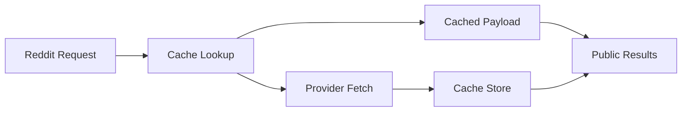

# Cache

## Overview

This document describes cache behavior for Reddit API responses. It proves
that repeat requests can reuse stored entries while callers retain explicit
cache control through the supported scraper surface.

Question this diagram answers: How does a repeat request reuse cached API
data?

## Main Model

### Cache Ownership

- API cache storage is private runtime state.
- Public cache controls should configure behavior without exposing cache
  internals.
- Cache stats may expose operational evidence without making storage layout
  public.

### Reuse Evidence

- A first request should populate cache when caching is enabled.
- A repeated equivalent request should avoid creating unrelated duplicate
  entries.
- Cache clearing is an explicit caller action, not hidden test setup.

### Verification Mirror

- The `cache` e2e slice proves cache population and reuse.
- It is separate from media cache behavior, which stores binary media entries.

## Rules

- Keep API cache behavior separate from media cache behavior.
- Keep cache keys and storage layout private.
- Preserve caller-visible cache controls and stats.
