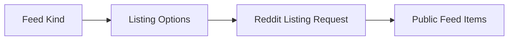

# Feeds

## Overview

This document describes feed-style Reddit listings: frontpage, all, popular,
geo variants, pagination, and time-filtered listing options. These calls are
listing reads rather than targeted post, user, or media operations.

Question this diagram answers: Which feed inputs shape a Reddit listing
request?

## Main Model

### Feed Kinds

- Frontpage, all, and popular feeds share one listing model.
- Geo-filtered popular feeds vary the provider request while preserving the
  public result shape.
- Time-filtered top listings use the same option-resolution path as other
  listing requests.

### Continuation

- Pagination uses provider cursors instead of caller-visible internal state.
- Later pages should preserve the same item shape as first-page feed results.
- Missing or unusable cursors should stop pagination cleanly.

### Verification Mirror

- The `feeds` e2e slice proves global feed families.
- The same slice proves geo filters, pagination, and time filters.

## Rules

- Keep feed behavior distinct from global search and subreddit-post behavior.
- Keep cursor parsing and request construction private.
- Treat provider listing shape changes as public behavior risks.
