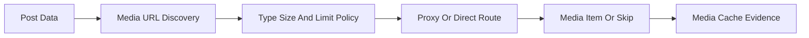

# Media

## Overview

This document describes media discovery and downloading. It owns image-post
detection, media URL extraction, type and size policy, proxy/direct routing,
download limits, and binary media cache reuse.

Question this diagram answers: How does discovered media become downloaded or
skipped media items?

## Main Model

### Discovery

- Image-post detection identifies posts with supported media URLs.
- On-demand downloading may start from a discovered URL or a post payload.
- Media extraction should ignore unsupported or missing media fields cleanly.

### Download Policy

- Media config controls enabled state, allowed types, file-size limits, and
  total download limits.
- Proxy/direct routing is a runtime choice based on URL, size, and policy.
- Abort and retry behavior should not crash caller workflows.

### Verification Mirror

- The `media` e2e slice proves image discovery, downloads, and cache reuse.
- The same slice proves on-demand download cache reuse.
- Integration tests prove private route-selection decisions.

## Rules

- Keep media downloading separate from JSON listing and API cache behavior.
- Keep routing, size checks, and cache storage private.
- Expose media outcomes through public media config, media items, and stats.
