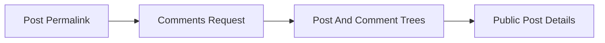

# Post Details

## Overview

This document describes fetching one Reddit post by permalink and returning
the post detail payload with nested comments. It starts from a known or
discovered permalink rather than a listing query.

Question this diagram answers: How does a permalink become post detail data?

## Main Model

### Detail Boundary

- A permalink identifies one post-detail request.
- The response may include post metadata plus nested comments.
- Comment replies should remain nested instead of being flattened into an
  unrelated listing shape.

### Comment Shape

- Comment authors, bodies, and replies should remain inspectable by callers.
- Deleted or unavailable comment fields should be handled without breaking the
  whole post detail response.
- Provider shape mismatches should cross as public scraper errors.

### Verification Mirror

- The `post_details` e2e slice proves permalink-driven post details.
- The same slice proves nested comment counting and comment author evidence.

## Rules

- Keep post details separate from listing and search concepts.
- Keep recursive comment parsing private.
- Return one stable post-detail shape through the public boundary.
