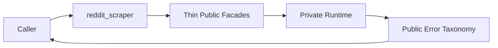

# Public Boundary And Errors

## Overview

This document describes the supported caller surface: `import reddit_scraper`.
`_api` organizes the facades and declarations behind that root import;
`_internal` is private.

Question this diagram answers: How do supported calls cross into private
runtime behavior and return stable failures?

## Main Model

### Supported Import

- Callers import from the top-level `reddit_scraper` package.
- Public facades expose stable functions, config objects, response shapes, and
  exceptions.
- Private runtime modules own provider calls, cache use, parsing, retries, and
  media handling.

### Failure Translation

The library wraps provider, request, parse, configuration, and usage failures
in a small Reddit scraper exception taxonomy so callers do not need to know
which internal component failed.

### Slice Consistency

- Search, feed, post, user, cache, retry, and media slices all return supported
  public values or public exceptions.
- Runtime-specific errors should be translated before crossing the package
  boundary.
- Caller contract violations should remain immediate and boring.

## Rules

- Keep `_api` thin and keep `_internal` private.
- Use `TypeError` or `ValueError` for immediate caller contract violations.
- Use custom Reddit scraper errors for runtime, configuration, provider, and
  parse failures that cross a public boundary.
