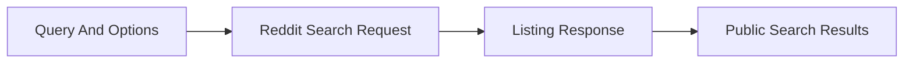

# Search

## Overview

This document describes global Reddit search. It owns query normalization,
caller search options, search-type filtering, and stable result summaries for
site-wide searches.

Question this diagram answers: How does a global search request become public
search results?

## Main Model

### Query Scope

- Global search is not tied to a subreddit.
- Caller options choose result limits, sort, time filter, and search types.
- Search-type filtering separates post-style results from subreddit results.

### Result Shape

- Results should be normalized enough for callers to inspect titles, links,
  authors, and subreddit context.
- Empty result sets are valid provider outcomes, not parser failures.
- Unsupported or malformed provider responses should cross as public scraper
  errors.

### Verification Mirror

- The `search` e2e slice proves global query behavior.
- The same slice proves search-type filtering.

## Rules

- Keep global search separate from subreddit-scoped search.
- Keep pagination, request construction, retry, and parsing in private runtime.
- Preserve stable public result dictionaries across replay-backed tests.
