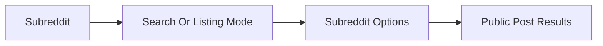

# Subreddit Posts

## Overview

This document describes behavior scoped to named subreddits. It includes
search inside a subreddit and fetching posts from subreddit listings such as
hot, new, top, or rising.

Question this diagram answers: How does a subreddit name constrain listing
behavior?

## Main Model

### Subreddit Scope

- The subreddit name is part of the behavior contract, not just a URL detail.
- Subreddit search combines a subreddit scope with a query and search options.
- Subreddit post listing combines a subreddit scope with listing options.

### Result Continuity

- Search results and listing results should preserve common post fields.
- Empty subreddit results are valid when Reddit returns no matching listing
  items.
- Invalid or unavailable subreddits should cross through public error behavior
  where the provider reports failure.

### Verification Mirror

- The `subreddit_posts` e2e slice proves subreddit search and post listing
  behavior.
- It is intentionally separate from global search and global feeds.

## Rules

- Keep subreddit-scoped behavior out of the global search concept.
- Keep provider URL assembly and cursor handling private.
- Preserve subreddit context in caller-visible results.
