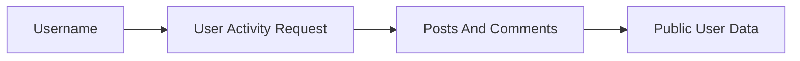

# User Data

## Overview

This document describes scraping activity for one Reddit username. It returns
a mixed timeline of user posts and comments while preserving enough context
for callers to distinguish item types.

Question this diagram answers: How does a username become user activity data?

## Main Model

### User Scope

- The username is the stable boundary for this slice.
- A caller may discover a username from another slice, then pass it into user
  data scraping.
- Fallback username behavior belongs outside the runtime contract and is a
  verification/demo concern.

### Activity Shape

- User data may contain posts, comments, or both.
- Each item should preserve enough context to identify item type and subreddit.
- Empty activity is valid when Reddit returns no visible user items.

### Verification Mirror

- The `user_data` e2e slice proves user activity scraping.
- The same slice proves item-type summaries for posts and comments.

## Rules

- Keep user data separate from subreddit and post-detail behavior.
- Keep pagination and provider-specific activity parsing private.
- Preserve item type information in public results.
