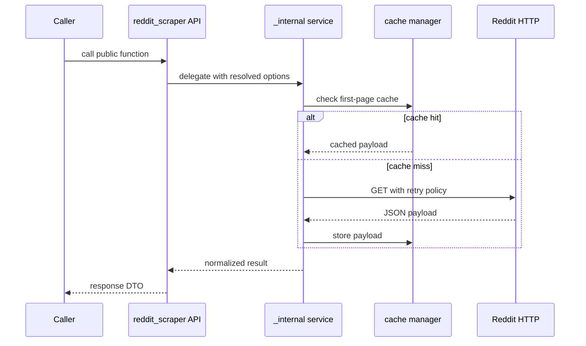

# Reddit Request Lifecycle

## Overview

This document describes the shared Reddit JSON request lifecycle used by
search, feed, post-detail, user-data, retry, and cache slices.

Question this diagram answers: How does a public call become a normalized
Reddit result?

## Main Flow

### Public Call

- Callers enter through the supported `reddit_scraper` root package.
- Facades resolve public options before delegating to private runtime services.
- Runtime services keep provider request details outside the public boundary.

### Provider Request

- First-page cache lookup may satisfy repeated requests.
- Cache misses perform Reddit HTTP requests with retry and stable logging.
- JSON payloads are parsed into normalized public result shapes.

### Boundary Return

- Successful flows return public response DTOs or result dictionaries.
- Provider, parse, and request failures are translated before crossing back to
  callers.

## Rules

- Log retries, cache hits/stores, notable decisions, parse failures, and
  operation durations with stable event names.
- Keep provider payload parsing private.
- Keep e2e replay focused on public calls, not private runtime methods.
