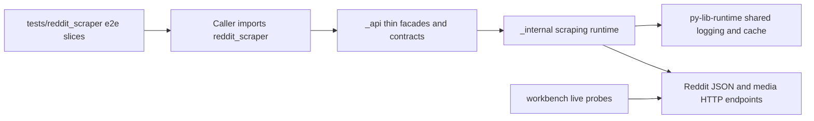

# Reddit Scraper System

## Overview

This document describes how Reddit scraper keeps a small public API over
private Reddit JSON, media, retry, cache, and logging runtime behavior.

Question this diagram answers: How does the public Reddit scraper package stay
thin while preserving real scraping behavior?

## Public Runtime Model

Callers import from `reddit_scraper` only. The root exports typed options,
response DTOs, public exceptions, function facades, `RedditScraper`, and
advanced media helpers.

## Execution Story

Public calls resolve options, delegate to private runtime services, perform
cache-aware Reddit requests, normalize provider payloads, and return stable
public results. See [flows/reddit-request-lifecycle.md](flows/reddit-request-lifecycle.md)
for the shared request flow.

## Runtime Shape

`_internal` owns scraping, parsing, retry, cache, and media download behavior.
Shared cross-cutting behavior such as structured logging and cache primitives
comes from `py-lib-runtime`, so this package does not carry a local
cross-cutting helper package. Workbench scripts stay live-first and do not
import the shipped package.
