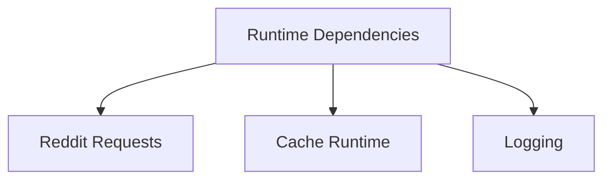

# Dependencies

## Overview

This document describes what the shipped dependency set supports and why each
main runtime package belongs in the library. It focuses on direct dependencies
rather than the full lockfile graph.

Question this diagram answers: Which product slices do the main shipped
dependencies support?

## Dependency Roles

### Reddit Requests

These packages support Reddit JSON and media request flows.

| Package          | Why it is shipped                                     | Status       |
| ---------------- | ----------------------------------------------------- | ------------ |
| `httpx`          | performs Reddit JSON and media HTTP requests          | core runtime |
| `tenacity`       | applies retry policy for transient request failures   | core runtime |
| `fake-useragent` | optionally randomizes user-agent values for live runs | edge runtime |

### Support Runtime

These packages support cross-cutting operational behavior.

| Package                 | Why it is shipped                                       | Status                    |
| ----------------------- | ------------------------------------------------------- | ------------------------- |
| `py-lib-runtime[cache]` | provides shared logging, previews, and persistent cache | direct runtime dependency |

### Cache Safety

`py-lib-runtime[cache]` uses a disk-backed cache implementation underneath.
Cache directories must be application-owned and must not be shared with
untrusted writers.

## Rules

- Do not add a shipped dependency unless it supports a public slice or a
  private runtime boundary that tests exercise.
- Keep dependencies grouped by runtime role, not by current import location.
- Record security caveats beside the dependency role they affect.
