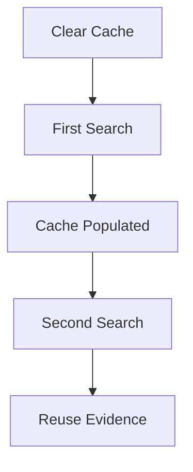
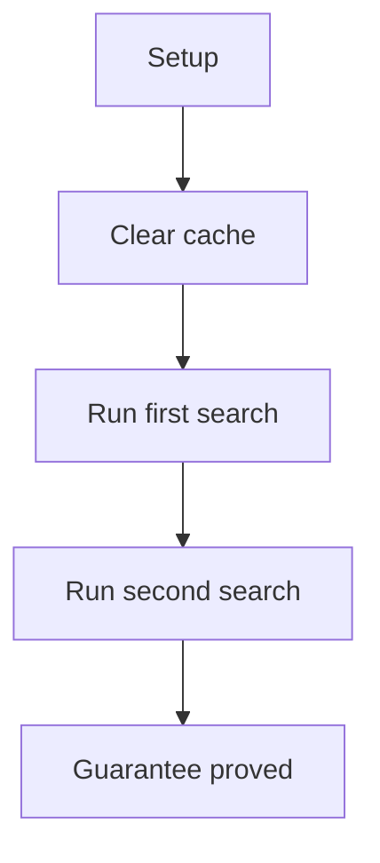

# Cache E2E Verification

## Overview

This document describes what the cache e2e slice proves at the public
boundary. It covers API cache population, repeat request reuse, and
caller-visible cache statistics.

Question this diagram answers: How is repeat request cache reuse proved?

## Proof Areas

## 1. Proof: API Cache Reuse

This proof area shows that repeated equivalent API requests populate and reuse
cache entries when caching is configured.

### Seen In Tests

[test_cache_pipeline.py](../../../../tests/reddit_scraper/e2e/cache/test_cache_pipeline.py)
proves a first global search populates cache evidence and a second equivalent
search does not create unrelated extra entries.

Question this diagram answers: How does the cache proof establish reuse?

Walkthrough:

1. The test uses an isolated temporary cache directory.
2. It clears cache, captures stats, runs a search, and captures stats again.
3. It repeats the same search and snapshots counts, cache enabled state, and
   entry counts before and after both calls.

Why this is sufficient:

- The proof observes public cache controls and stats.
- Comparing entry counts across two equivalent searches catches missed reuse.

Would fail if:

- Cache writes stopped happening after a cacheable request.
- Repeat equivalent requests produced new cache entries instead of reuse.
