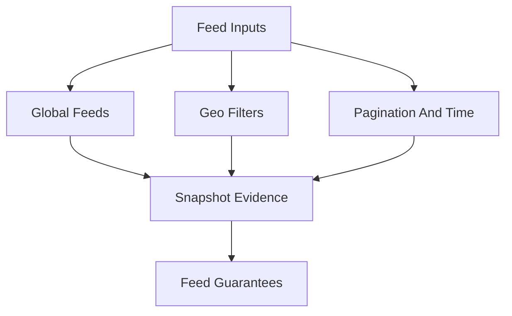
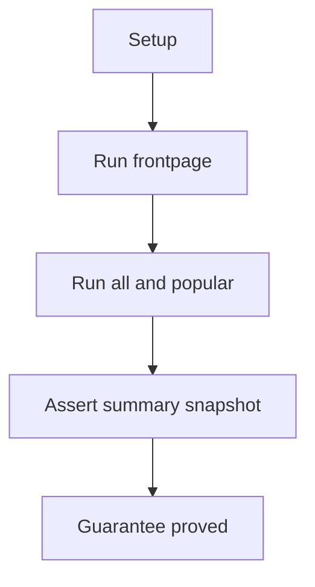
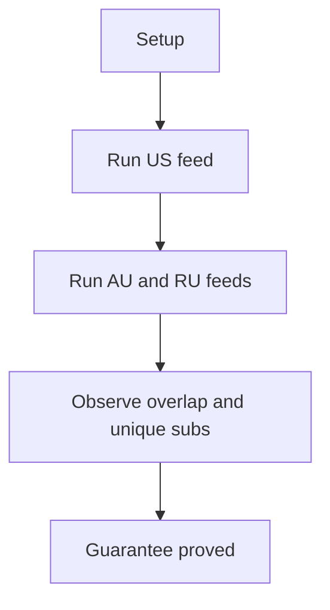
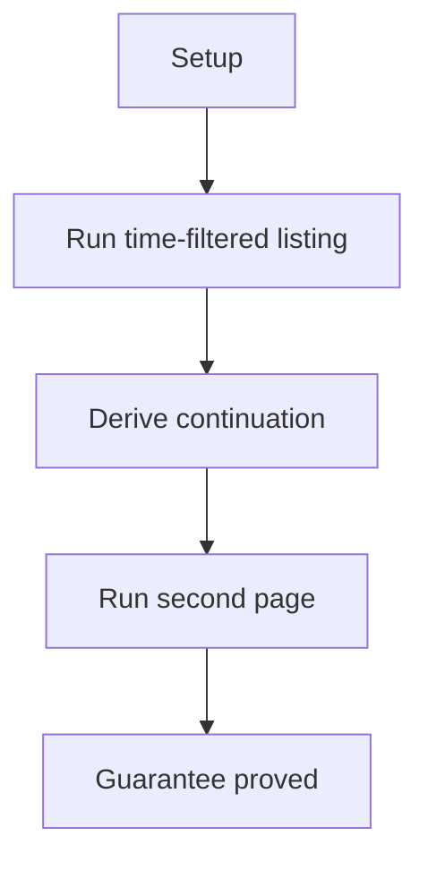

# Feeds E2E Verification

## Overview

This document describes what the feeds e2e slice proves at the public
boundary. It covers feed-style listing reads rather than targeted subreddit,
post-detail, user, cache, or media behavior.

Question this diagram answers: Which feed behaviors are proved by replay?

## Proof Areas

## 1. Proof: Global Feed Families

This proof area shows that the public feed calls return distinct, stable
listing summaries for frontpage, all, and popular feeds.

### Seen In Tests

[test_global_feeds_pipeline.py](../../../../tests/reddit_scraper/e2e/feeds/test_global_feeds_pipeline.py)
proves frontpage, all, and popular feed calls return replay-backed counts and
sample subreddit evidence.

Question this diagram answers: How does the global feed proof compare feed
families?

Walkthrough:

1. The test replays separate public calls for frontpage, all, and popular.
2. Each call uses explicit feed options such as limit, category, and time
   filter.
3. The snapshot records counts and representative subreddit evidence.

Why this is sufficient:

- Multiple feed families are exercised in one scenario with stable replay.
- The proof catches accidental mixing of frontpage, all, and popular behavior.

Would fail if:

- Feed-specific options stopped influencing the provider request.
- Feed results stopped returning caller-visible post summaries.

## 2. Proof: Geographic Filters

This proof area shows that geo-filtered popular feeds remain supported and
produce visible regional evidence.

### Seen In Tests

[test_geo_filters_pipeline.py](../../../../tests/reddit_scraper/e2e/feeds/test_geo_filters_pipeline.py)
proves popular feeds can be requested with different geo filters and compared
through public result summaries.

Question this diagram answers: How does the geo proof establish filter
behavior?

Walkthrough:

1. The test replays popular-feed requests for three geo filters.
2. It summarizes counts, subreddit overlap, and unique subreddit evidence.
3. It snapshots the comparison instead of asserting a live regional ranking.

Why this is sufficient:

- The proof verifies the caller can pass geo filters without provider errors.
- Comparing regions catches a filter path that silently ignores the geo value.

Would fail if:

- Geo filter options stopped reaching popular feed requests.
- Region-specific responses were normalized into indistinguishable output.

## 3. Proof: Pagination And Time Filters

This proof area shows that feed/search listing options support time-filtered
results and cursor-style continuation.

### Seen In Tests

[test_pagination_timefilter_pipeline.py](../../../../tests/reddit_scraper/e2e/feeds/test_pagination_timefilter_pipeline.py)
proves a time-filtered listing and a second page request can be replayed and
summarized.

Question this diagram answers: How does the pagination proof catch
continuation drift?

Walkthrough:

1. The test uses a configured time-filtered listing request.
2. It derives continuation evidence from first-page output.
3. It snapshots first-page and second-page counts plus continuation metadata.

Why this is sufficient:

- The proof observes the complete public pagination flow, not a cursor helper.
- Replay makes the continuation scenario deterministic.

Would fail if:

- Time-filter options stopped shaping the listing request.
- Pagination stopped preserving compatible public result shapes.
