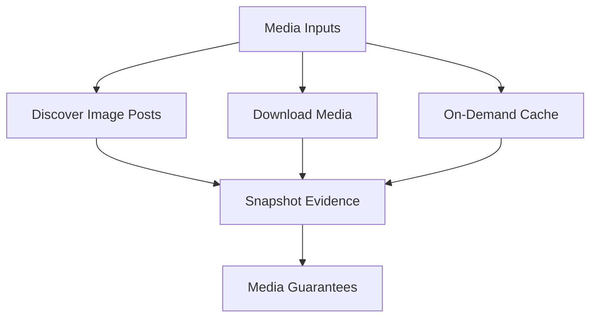
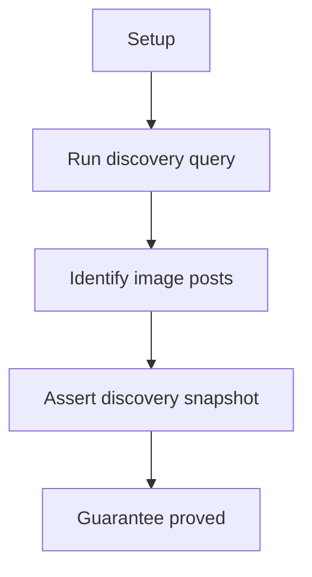
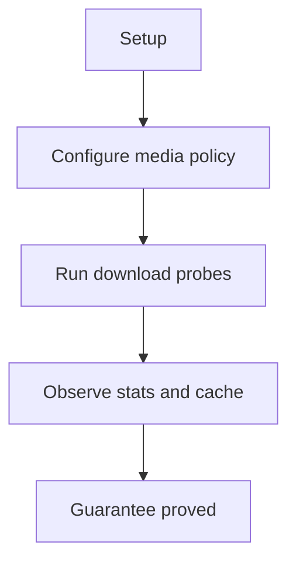
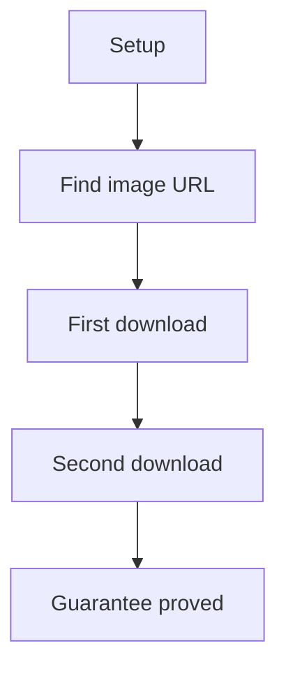

# Media E2E Verification

## Overview

This document describes what the media e2e slice proves at the public
boundary. It covers image-post discovery, public media download behavior,
abort/retry behavior, and binary media cache reuse.

Question this diagram answers: Which media guarantees are replayed?

## Proof Areas

## 1. Proof: Image Post Discovery

This proof area shows that the media slice can find posts with supported image
evidence before download behavior is considered.

### Seen In Tests

[test_image_posts_pipeline.py](../../../../tests/reddit_scraper/e2e/media/test_image_posts_pipeline.py)
proves subreddit/search output can be summarized for image-post discovery.

Question this diagram answers: How does the discovery proof establish media
input evidence?

Walkthrough:

1. The test replays a public scraping path that can return image-bearing
   posts.
2. It summarizes discovered media evidence without downloading every item.
3. It snapshots image-post counts and representative URL evidence.

Why this is sufficient:

- The proof verifies media extraction starts from public post data.
- Discovery evidence catches regressions before network download policy is
  involved.

Would fail if:

- Supported image URLs stopped being detected from Reddit post payloads.
- Media discovery started treating unsupported fields as valid media.

## 2. Proof: Media Download Behavior

This proof area shows that media downloading exposes defaults, stats,
abort/retry behavior, and media cache reuse through public surfaces.

### Seen In Tests

[test_media_download_pipeline.py](../../../../tests/reddit_scraper/e2e/media/test_media_download_pipeline.py)
proves public media defaults, stats, abort/retry behavior, and cache reuse
evidence.

Question this diagram answers: How does the download proof cover public media
behavior?

Walkthrough:

1. The test builds media config from public defaults with focused overrides.
2. It runs download probes for default state, stats, abort/retry, and cache
   integration.
3. It snapshots download status, cache hits, and media stats.

Why this is sufficient:

- The proof observes the public media surface plus caller-visible stats.
- Route-selection specifics stay in integration tests because they target
  private routing helpers.

Would fail if:

- Media cache or abort/retry stats stopped reflecting real download behavior.

## 3. Proof: On-Demand Download Cache

This proof area shows that a discovered media URL can be downloaded on demand
and reused from media cache on repeat access.

### Seen In Tests

[test_on_demand_download_pipeline.py](../../../../tests/reddit_scraper/e2e/media/test_on_demand_download_pipeline.py)
proves an image URL can be discovered, downloaded, saved, and downloaded again
with cache evidence.

Question this diagram answers: How does the on-demand proof establish media
cache reuse?

Walkthrough:

1. The test discovers or receives an image URL through the public media flow.
2. It clears an isolated media cache and downloads the image once.
3. It downloads the same image again and snapshots download status, size, and
   cache-hit evidence.

Why this is sufficient:

- The proof checks both byte retrieval and repeat cache behavior.
- Isolated cache directories keep the result independent from local developer
  state.

Would fail if:

- On-demand downloads stopped returning media item metadata.
- Repeat downloads stopped surfacing cache evidence.
