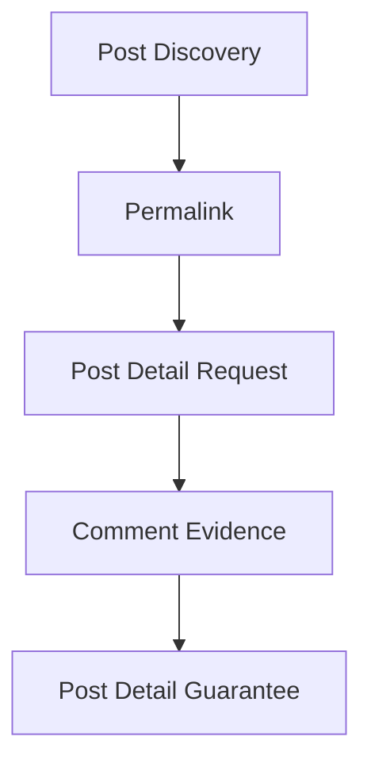
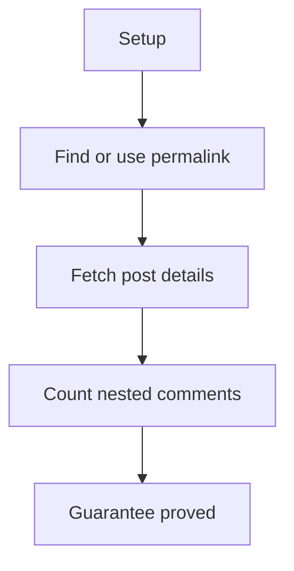

# Post Details E2E Verification

## Overview

This document describes what the post details e2e slice proves at the public
boundary. It covers finding or using a permalink and returning a post detail
payload with nested comments.

Question this diagram answers: How is one post detail flow proved by replay?

## Proof Areas

## 1. Proof: Post Comments

This proof area shows that a permalink-driven request returns post details
with comment evidence that callers can inspect.

### Seen In Tests

[test_post_comments_pipeline.py](../../../../tests/reddit_scraper/e2e/post_details/test_post_comments_pipeline.py)
proves post detail scraping returns a post payload with nested comment counts
and top-author evidence.

Question this diagram answers: How does the post detail proof establish
comment parsing?

Walkthrough:

1. The test starts from a search result or a fallback permalink.
2. It replays the post-detail request for that permalink.
3. It snapshots title/permalink evidence, recursive comment count, and top
   comment authors.

Why this is sufficient:

- The proof observes the caller-facing post-detail shape.
- Recursive comment counting catches broken nested-comment extraction.

Would fail if:

- Permalink handling stopped reaching the post-detail endpoint.
- Comment trees were dropped, flattened incorrectly, or parsed into the wrong
  shape.
