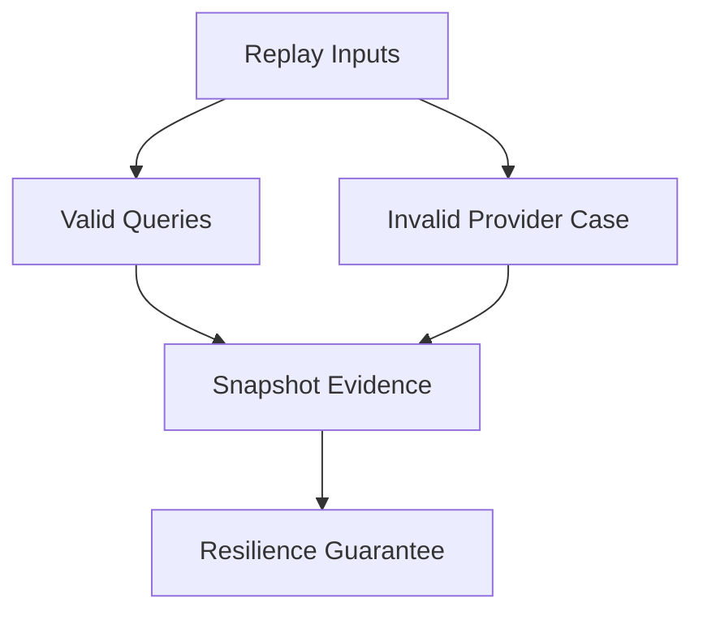
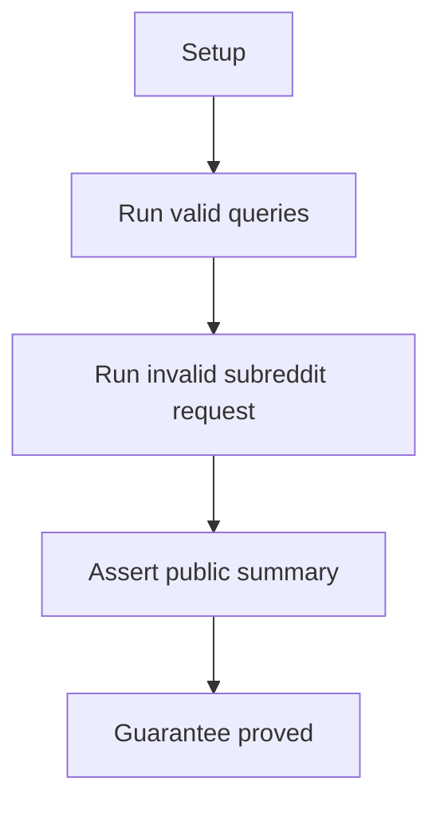

# Retry E2E Verification

## Overview

This document describes what the retry e2e slice proves at the public
boundary. It covers successful public requests and invalid provider outcomes
without depending on Reddit being flaky during test execution.

Question this diagram answers: How are request failures proved safely?

## Proof Areas

## 1. Proof: Public Request Resilience

This proof area shows that replayed public request flows complete for valid
queries and degrade predictably for an invalid subreddit.

### Seen In Tests

[test_retry_pipeline.py](../../../../tests/reddit_scraper/e2e/retry/test_retry_pipeline.py)
proves valid query counts and invalid subreddit handling through public scraper
calls.

Question this diagram answers: How does the retry proof avoid live flakiness?

Walkthrough:

1. The test replays valid query requests through the public scraper surface.
2. It replays an invalid subreddit request through the same public surface.
3. It snapshots query counts and empty invalid-result evidence.

Why this is sufficient:

- The proof checks degraded provider behavior without uncontrolled network
  instability.
- Integration tests separately prove the private retry transport seam.

Would fail if:

- Invalid provider responses leaked raw transport or parser exceptions.
- Public retry-path calls stopped returning stable result summaries.

Trust assumptions:

- Private retry mechanics are covered by integration tests with a local flaky
  endpoint.
