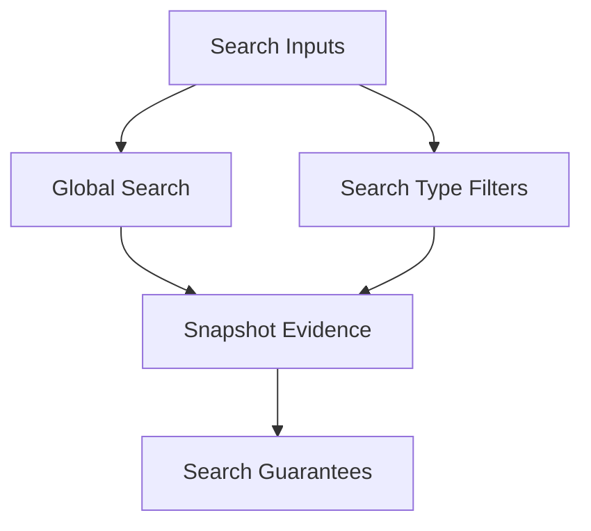
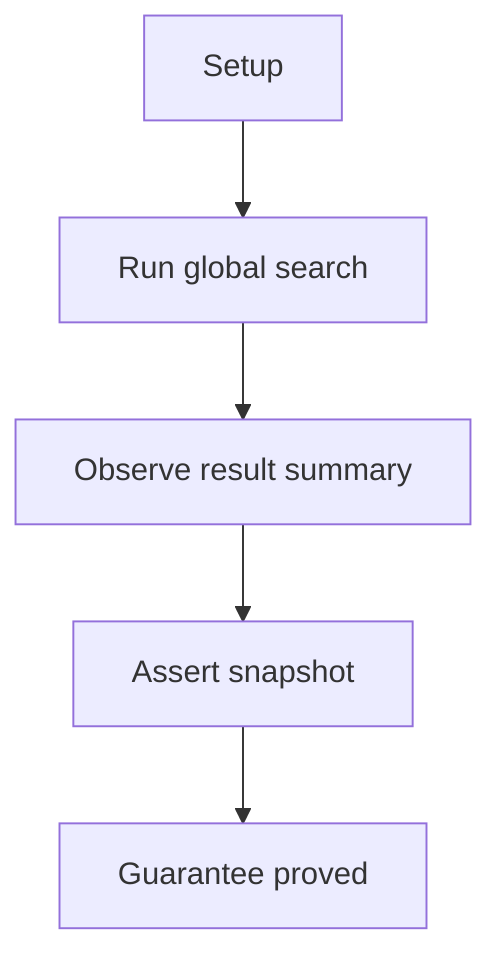
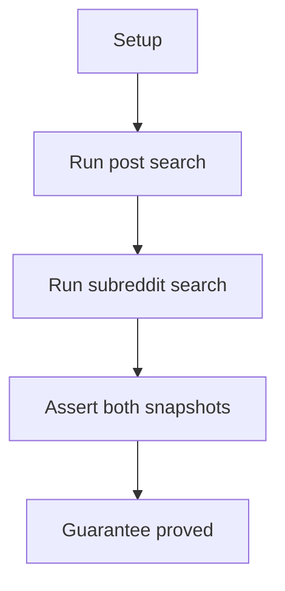

# Search E2E Verification

## Overview

This document describes what the search e2e slice proves at the public
boundary. It covers global query search and search-type filtering without
mixing in subreddit-scoped behavior.

Question this diagram answers: What public search guarantees are replayed?

## Proof Areas

## 1. Proof: Global Search

This proof area shows that a caller can run a global Reddit search and receive
stable public result summaries.

### Seen In Tests

[test_search_pipeline.py](../../../../tests/reddit_scraper/e2e/search/test_search_pipeline.py)
proves global query search returns replay-backed result counts and sample
fields through the supported package boundary.

Question this diagram answers: How does the global search proof establish a
public result contract?

Walkthrough:

1. The test requires a committed VCR cassette or explicit recording mode.
2. It runs a global `python programming` search through the public package.
3. It snapshots result count and representative title/subreddit/permalink
   evidence.

Why this is sufficient:

- The proof observes the caller-facing output shape, not private parser state.
- The VCR cassette makes the provider response replayable and reviewable.

Would fail if:

- Global search stopped returning list-style public results.
- Result normalization dropped stable sample fields callers depend on.

## 2. Proof: Search Type Filtering

This proof area shows that caller search-type options affect global search
results in a visible, stable way.

### Seen In Tests

[test_search_types_pipeline.py](../../../../tests/reddit_scraper/e2e/search/test_search_types_pipeline.py)
proves post-only and subreddit-only search modes produce distinct public
summaries.

Question this diagram answers: How does the search-type proof catch filter
drift?

Walkthrough:

1. The test replays two global searches for the same query.
2. One search asks for link results and the other asks for subreddit results.
3. It snapshots separate counts and representative labels for both result
   families.

Why this is sufficient:

- The same query isolates the search-type option as the meaningful variable.
- Snapshot evidence proves both branches remain caller-visible.

Would fail if:

- Search-type parameters stopped reaching the provider request.
- Subreddit search results were normalized like ordinary post results.
