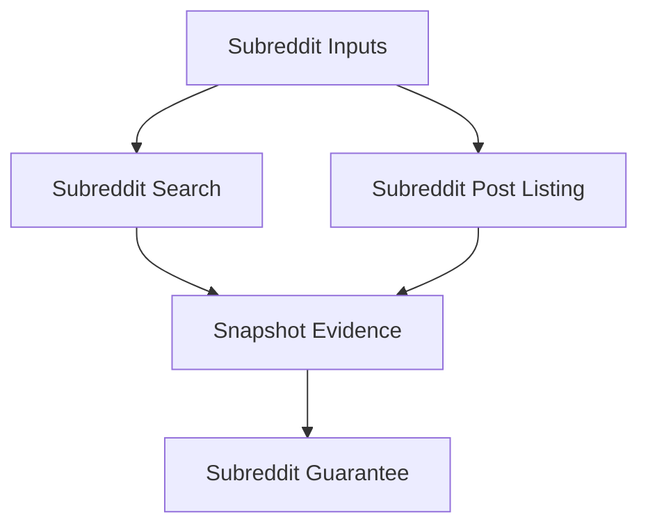
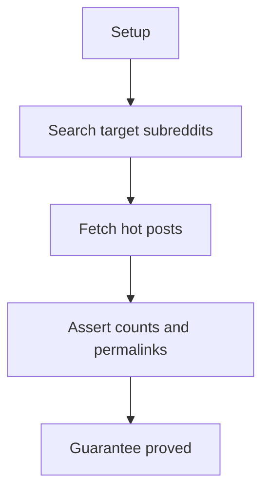

# Subreddit Posts E2E Verification

## Overview

This document describes what the subreddit posts e2e slice proves at the
public boundary. It covers behavior constrained by subreddit names, including
subreddit search and subreddit post listing.

Question this diagram answers: How is subreddit scope proved by replay?

## Proof Areas

## 1. Proof: Subreddit Search And Listings

This proof area shows that subreddit-scoped calls preserve subreddit context
while returning stable public summaries.

### Seen In Tests

[test_subreddit_posts_pipeline.py](../../../../tests/reddit_scraper/e2e/subreddit_posts/test_subreddit_posts_pipeline.py)
proves searching inside configured subreddits and fetching hot posts for one
subreddit work in one replay-backed scenario.

Question this diagram answers: How does the subreddit proof cover both scoped
operations?

Walkthrough:

1. The test replays searches inside two configured subreddit names.
2. It then replays a hot-post listing for a configured subreddit.
3. It snapshots per-subreddit search counts, hot-post count, and permalink
   evidence.

Why this is sufficient:

- The proof exercises both subreddit-scoped public behaviors in one pipeline.
- Counts and permalinks catch scope loss without exposing provider internals.

Would fail if:

- Subreddit names stopped constraining search or listing requests.
- Subreddit post listing returned malformed or wrong-scope post summaries.
