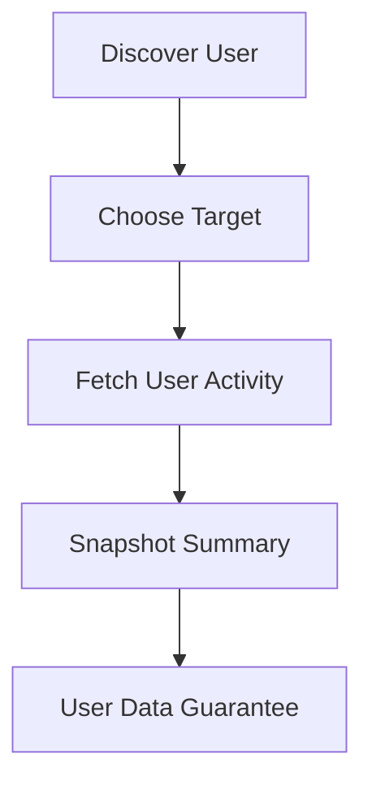
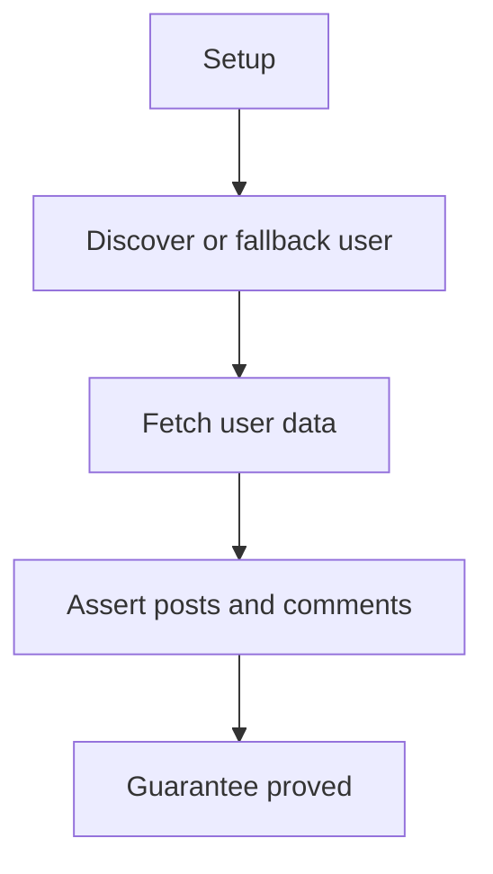

# User Data E2E Verification

## Overview

This document describes what the user data e2e slice proves at the public
boundary. It covers selecting a username from public Reddit data or fallback
input and returning visible user activity.

Question this diagram answers: How is username-centered scraping proved?

## Proof Areas

## 1. Proof: User Activity

This proof area shows that user activity scraping returns a stable public
summary of posts and comments for a target username.

### Seen In Tests

[test_user_data_pipeline.py](../../../../tests/reddit_scraper/e2e/user_data/test_user_data_pipeline.py)
proves a target user can be selected and used to fetch replay-backed posts and
comments.

Question this diagram answers: How does the user data proof establish activity
shape?

Walkthrough:

1. The test replays a subreddit listing to discover a non-deleted author.
2. It falls back to a configured username if discovery cannot provide one.
3. It snapshots target user, total item count, post/comment counts, and
   subreddit evidence.

Why this is sufficient:

- The proof covers both target selection and user activity retrieval.
- Item-type counts catch loss of post/comment distinction.

Would fail if:

- User scraping returned an empty target despite fallback input.
- User activity normalization lost item type or subreddit context.
