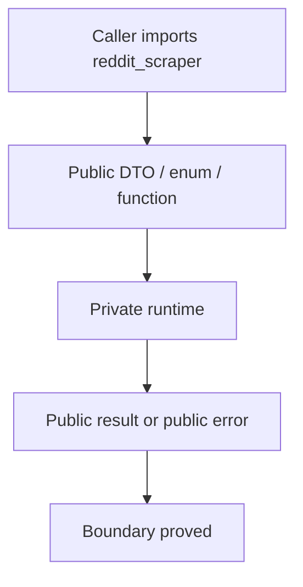
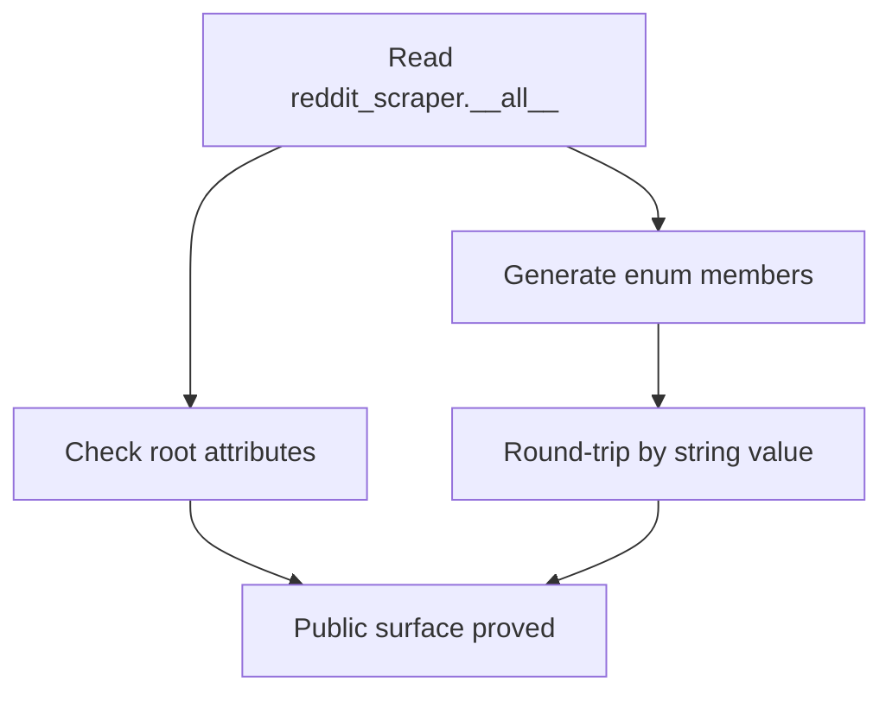

# Public Boundary And Errors Verification

## Overview

This document describes how `reddit_scraper` proves that callers use the root
package surface, receive stable DTOs and enum vocabulary, and see public error
types for configuration, usage, provider, request, and response failures.

Question this diagram answers: Which checks catch public boundary drift before
it reaches callers?

## 1. Proof: Public Surface Stays Coherent

This proof area shows that the supported root package exports every advertised
name and that public string enums keep round-trip semantics.

### Seen In Tests

[test_public_exports_and_enums.py](../../../tests/reddit_scraper/property_based/public_contract/test_public_exports_and_enums.py)
proves `reddit_scraper.__all__` exposes all listed names, avoids private names,
and preserves public enum value round-tripping.

Question this diagram answers: How do public export checks catch caller-facing
drift?

Why this is sufficient:

- The proof targets the only supported import boundary.
- Enum assertions catch accidental value changes in caller-visible options.

Would fail if:

- A public name was removed from the root package.
- A private name leaked through `__all__`.
- An enum value stopped reconstructing its original member.

## 2. Proof: Public DTOs And Config Validate Caller Inputs

This proof area shows that option, response, config, and media DTOs keep stable
construction and validation behavior.

### Seen In Tests

[test_public_options.py](../../../tests/reddit_scraper/property_based/public_contract/test_public_options.py)
proves public option DTOs preserve explicit values, remain frozen, and install
only valid `RedditScraperConfig` snapshots.

[test_public_media_config.py](../../../tests/reddit_scraper/property_based/public_contract/test_public_media_config.py)
proves media config normalizes valid inputs and raises public configuration
errors for invalid media options.

[test_public_responses.py](../../../tests/reddit_scraper/property_based/public_contract/test_public_responses.py)
proves public response DTOs preserve caller-visible fields.

Why this is sufficient:

- The tests construct public objects exactly as callers do.
- Invalid inputs are checked at construction or installation boundaries.

Would fail if:

- DTO fields became mutable or stopped preserving explicit values.
- Invalid media or config inputs leaked private validation details.

## 3. Proof: Public Error Taxonomy Stays Stable

This proof area shows that public exception classes remain inside the supported
Reddit scraper error hierarchy and keep caller-visible context.

### Seen In Tests

[test_public_exceptions.py](../../../tests/reddit_scraper/property_based/public_contract/test_public_exceptions.py)
proves exported `RedditScraper*Error` types subclass `RedditScraperError` and
preserve message, cause, and context semantics.

Why this is sufficient:

- The proof checks the public error classes directly.
- It catches accidental taxonomy breaks before runtime flows expose them.

Would fail if:

- A public error stopped subclassing `RedditScraperError`.
- Error construction stopped preserving cause or context.

## 4. Proof: Boundary Direction Stays Enforced

This proof area shows that tests and package code keep the intended public and
private dependency direction.

### Seen In Checks

`uv run lint-imports --config pyproject.toml` proves package layers keep their
approved import direction.

`uv run py-lib-check-public-contract-private-references` proves public-contract
tests do not verify supported behavior through private internals.

`uv run py-lib-smoke-public-api` proves the built package exposes a coherent
public API from an installed artifact.

Why this is sufficient:

- Import contracts catch accidental dependency direction drift.
- Public API smoke catches installed-package export drift.

Would fail if:

- Public-contract tests started importing private modules.
- `_api` or `_internal` imports crossed forbidden boundaries.
- The installed artifact stopped exposing the root public API.
